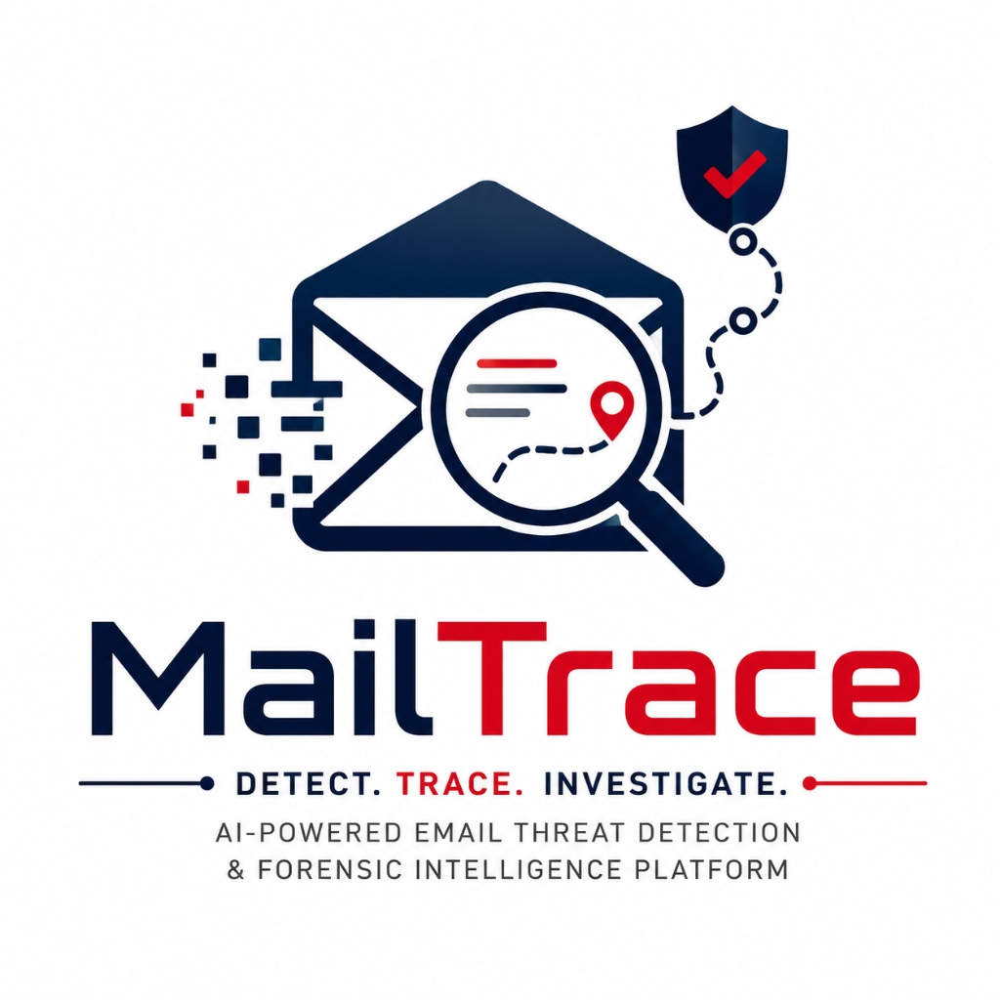

<p align="center">
  
</p>

<h1 align="center">ThreatTrace AI ✉️🔍🛡️</h1>

<p align="center">
  <b>AI-Powered Email Threat Detection & Forensic Intelligence Platform</b><br />
  <i>Smart India Hackathon (SIH) 2026 — Problem Statement 106</i>
</p>

<p align="center">
  <a href="LICENSE"></a>
  <a href="https://github.com/JayantOlhyan/ThreatTrace-AI"></a>
  <a href="https://python.org"></a>
  <a href="https://fastapi.tiangolo.com"></a>
  <a href="https://nextjs.org"></a>
  <a href="ARCHITECTURE.md"></a>
</p>

---

## 🎯 Overview

**ThreatTrace AI** is an enterprise-grade forensic intelligence and email threat detection platform built specifically for cybersecurity analysts and incident responders. Designed for **SIH 2026 Problem Statement 106**, ThreatTrace AI goes beyond simple spam/phishing classification by answering key investigation questions:

- **Why is this email suspicious?**
- **How did it reach the recipient?**
- **What infrastructure was involved?**
- **What is the probable origin infrastructure?**
- **Is this infrastructure connected to previous incidents or campaigns?**

---

## 🌟 Key Features

- **📧 RFC 5322 MIME & Header Parser**: Full MIME decomposition, multi-part attachment extraction, and ordered Received hop chain analysis.
- **🛡️ SPF / DKIM / DMARC Verification**: Cryptographic email authentication and spoofing detection.
- **📍 Origin & Relay Tracing**: Distinguishes *Observed Origin IP* from *Probable Origin Infrastructure* with confidence scoring.
- **🧠 AI & NLP Threat Detection**: Identifies social engineering, urgency tactics, credential harvesting, and Business Email Compromise (BEC).
- **⚡ Centralized Risk Engine**: Defensive 0–100 threat severity scoring with explainable evidence binding.
- **🔗 Bounded Investigation Graph**: Entity resolution connecting emails, IP subnets, lookalike domains, and campaign candidates (`CMP-xxxxxx`).
- **🖥️ SOC Workspace**: Modern Next.js 14 Web UI with interactive graph visualizations, timeline analysis, and analyst decision logs.
- **📜 Forensic Reporting & Cryptographic Export**: Generates PDF forensic reports and downloadable `.zip` evidence packages containing `manifest.json` with SHA-256 evidence hashes.
- **🛡️ Hardened Security & SSRF Protection**: Outbound IP validation (`backend/app/security/ssrf.py`) and HTML AST sanitization (`backend/app/security/sanitizer.py`).

---

## 📚 Documentation

- 📐 **[ARCHITECTURE.md](ARCHITECTURE.md)** — System Pipeline & Module Design
- 🔌 **[API.md](API.md)** — Complete REST API Specification
- 🛡️ **[SECURITY.md](SECURITY.md)** — SSRF Protection & HTML Sanitization Guidelines
- 🚀 **[DEPLOYMENT.md](DEPLOYMENT.md)** — Local Setup & Server Running Instructions
- 🏆 **[DEMO.md](DEMO.md)** — SIH 2026 3-5 Minute Presentation Workflow
- ⚙️ **[ENVIRONMENT.md](ENVIRONMENT.md)** — Environment Variables Reference
- ⚠️ **[LIMITATIONS.md](LIMITATIONS.md)** — Scope Boundaries & Technical Limitations

---

## ⚡ Quickstart

### Running Backend API (FastAPI)
```bash
cd backend
PYTHONPATH=. venv/bin/uvicorn app.main:app --host 127.0.0.1 --port 8000 --reload
```

### Running Frontend UI (Next.js)
```bash
cd frontend
npm run dev -- -p 3002
```

### Running Test Suite
```bash
PYTHONPATH=backend backend/venv/bin/pytest backend/tests/ -v
```

---

## 📜 License

This project is licensed under the [MIT License](LICENSE).
