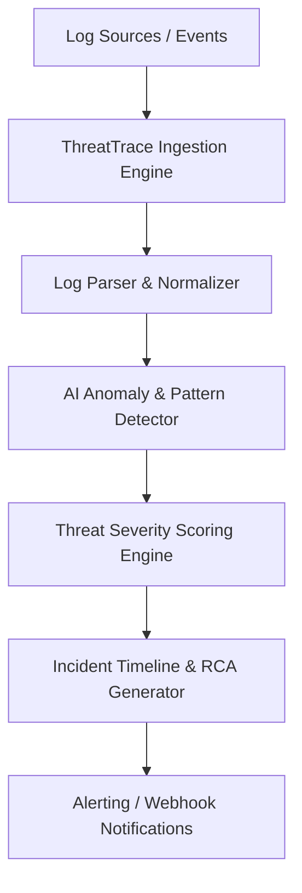

# ThreatTrace AI 🛡️🤖

> **Next-Generation Open-Source AI Threat Detection & Incident Traceability Platform**

ThreatTrace AI is an autonomous, open-source security intelligence framework designed to analyze system logs, network traces, and security events in real-time using modern AI models. It reconstructs attack vectors, calculates risk scores, and provides actionable remediation guidance.

---

## 🌟 Key Features

- **🧠 Multi-Model AI Analysis**: Integrates LLMs and anomaly detection heuristics to identify zero-day threats, suspicious lateral movement, and privilege escalation.
- **🔍 Log & Event Correlation**: Ingests syslog, CloudTrail, Auth logs, and container events to build dynamic incident timelines.
- **⚡ Real-Time Alerting & Scoring**: Computes dynamic Threat Severity Index (TSI) scores with CVSS alignment.
- **📋 Interactive Reports & Playbooks**: Generates incident root-cause analysis (RCA) reports and automated containment playbooks.
- **🛠️ Extensible Plugin System**: Easily attach custom threat intelligence feeds and custom rule evaluators.

---

## 🚀 Quick Start

### Prerequisites

- Node.js >= 18.x
- npm / pnpm / yarn

### Installation

```bash
# Clone the repository
git clone https://github.com/JayantOlhyan/ThreatTrace-AI.git
cd ThreatTrace-AI

# Install dependencies
npm install

# Build the project
npm run build
```

### Basic Usage

```bash
# Run ThreatTrace CLI scanner against a sample log file
npx threattrace analyze --file sample_auth.log

# Start ThreatTrace API server & dashboard backend
npm run start
```

---

## 📂 Architecture Overview



---

## 🤝 Contributing

Contributions are welcome! Please feel free to open issues or submit pull requests.

1. Fork the Project
2. Create your Feature Branch (`git checkout -b feature/AmazingFeature`)
3. Commit your Changes (`git commit -m 'feat: Add some AmazingFeature'`)
4. Push to the Branch (`git checkout -b feature/AmazingFeature`)
5. Open a Pull Request

---

## 📄 License

Distributed under the MIT License. See `LICENSE` for more information.
